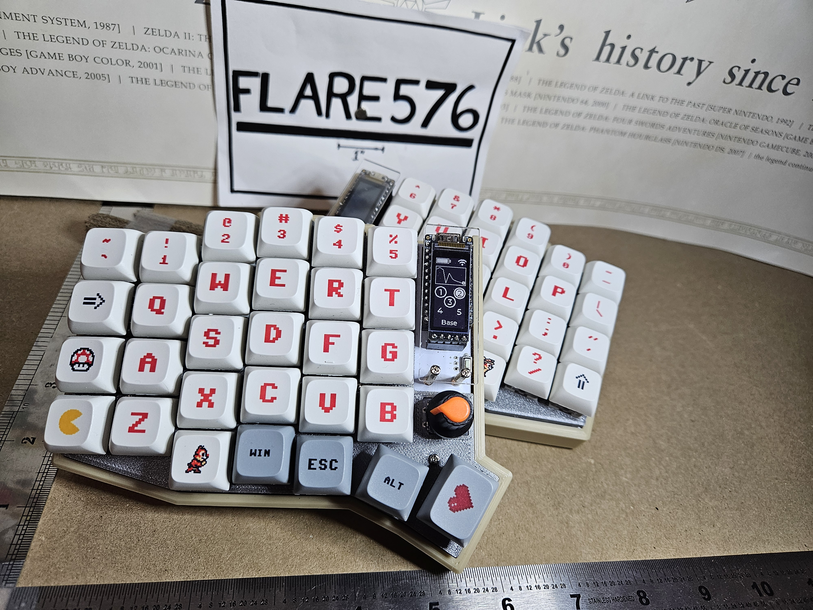
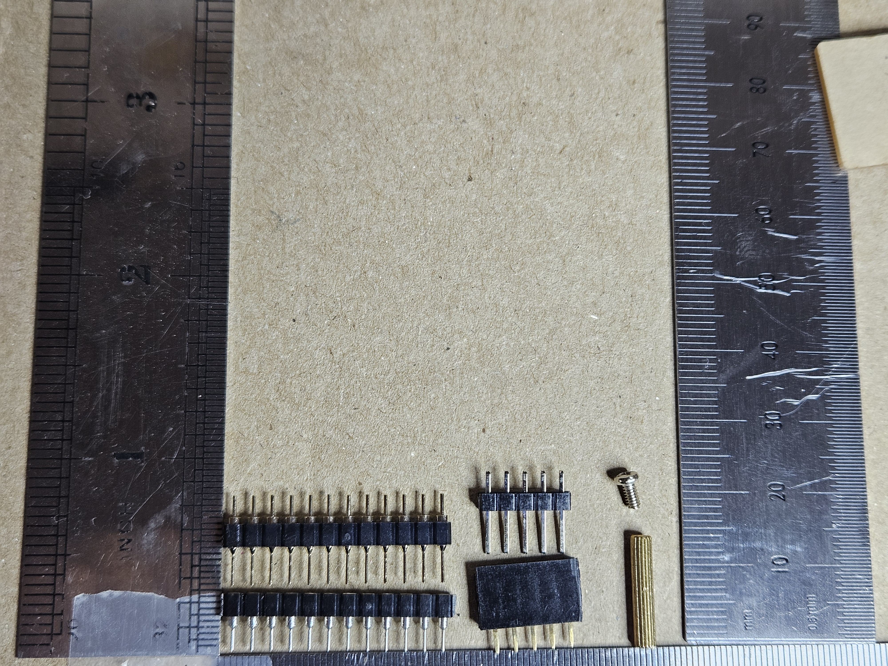
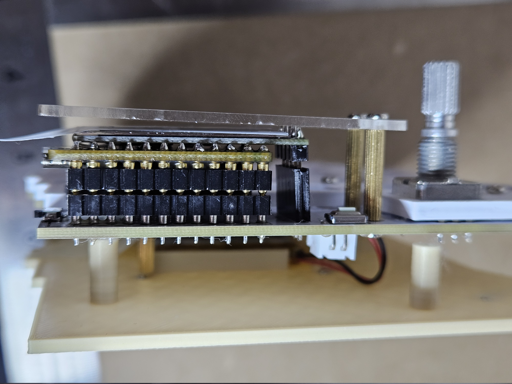
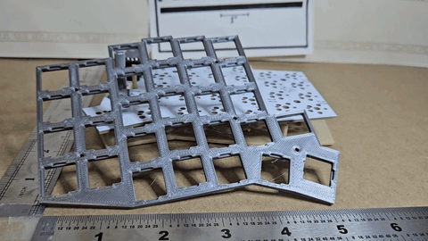
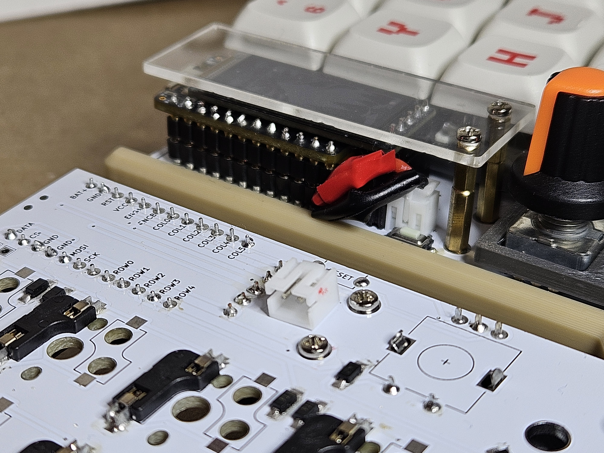
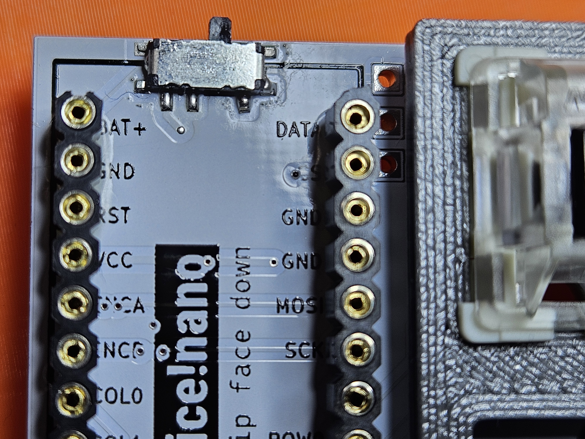
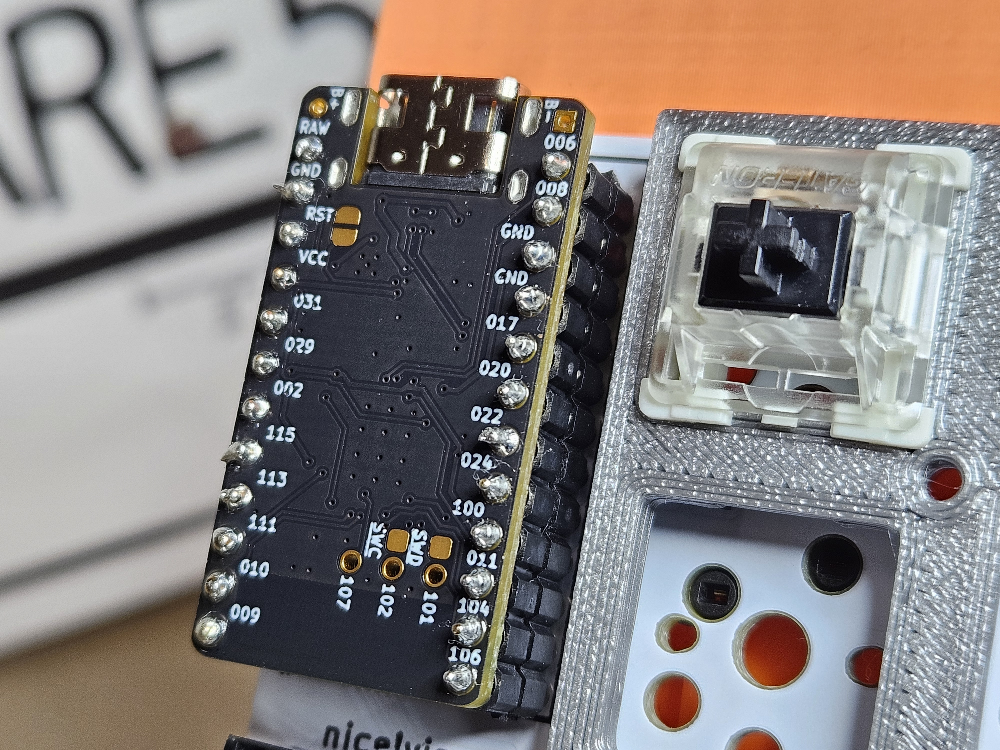

The Sofle V2.Wireless is a variation of the Sofle with:

- Support for both MX and Kailh Choc sockets/switches
    * Returned from the V1 boards!
- JST Ports
    * Wireless needs batteries and batteries need replacing!
- Power Switches
    * Unplugging batteries is cumbersome!
- Migration from standard ProMicro to nice!Nano
    * Or other Bluetooth-Ready Microcontroller
- Migration from QMK to ZMK
    * New Hardware, new Firmware
- A revised pin-out for the low-power nice!View display
    * Or other 5-pin display
- Opinionated Gerber sides
    * Panels over reversible boards
- No TR(R)S jacks
    * Peripheral board always communicates over BT to main board

The boards are compatible with V2 top-plates, bottom plate, and cases with the following caveats:

- There's no TRRS port, so you may have to patch holes in cases
- The encoder slot is **NOT** switch-compatible
- You PROBABLY need access to the power switch, so cases that block the PCB under the microcontroller will be tricky
- The Reset button moved ~10mm lower on the board to allow for the Nice hardware/power switch/etc.

The Sofle V2.Wireless was designed by [Garrett Faucher], based on the timeless Sofle V2 by [Josef Adamčík].

# Bill Of Materials

## Required

The following is needed to build the board:

- **1x PCB**. Send `Gerbers/v2.0w/Sofle_v2.02_gerber.zip` to a PCB fabrication service. JLCPCB's default settings for 1.6mm boards is fine

- **2x Top Plates**. Any V2 Top Plates will do. If 3D-Printing, I recommend [Switch Plate] by [mauC], but installing them with the notches **DOWN** (see main build guide).

- **2x Case/Bottoms**. Any V2 bottom plate or case will do. If 3D-Printing, I made [Base Plate and Case] options.

- **2x nice!Nano** boards or compatible. Do not get base-model ProMicros for this build - there is no TR(R)S port, so it **MUST** support Bluetooth.

- **4x 12-Pin 2.54 Pitch Headers (and Optional Sockets)** for nice!Nanos. The encoders will likely be the tallest part of your build, so I highly recommend the sockets, but **NOT** the ones that ship with most Nanos. (see main build guide)

- **58x MX or Kailh Choc Keyboard Sockets** Don't try to direct-solder the switches to the board - future-you will not appreciate the choice.

- **58x MX or Kailh Choc Keyboard Switches** Your sanity will thank you for not mixing them, but as long as they match the sockets you use, it'll work

- **58x Key Caps** Again, make sure the caps match your switches. Two (thumb) caps should be `1.5u`, the rest `1u`

- **60x diodes 1N4148W**. Surface mount diodes in SOD123 package. Pick any common variation. I used `1N4148WTR` (Digi-Key 1655-1360-1-ND). Voltage specifications and specifics don't seem to matter for low-voltage keyboards
    - _Note_: Other build guides indicate only 58 diodes are "Necessary" - Don't do that to yourself - get an encoder with click.

- **2x Buttons**  momentary, tactile, through-hole, 2 pins, I used one for DIP switches, 3x6x4.3mm. Technically optional: you can use metal tweezers whenever you need to reset the microcontroller.

- **2x Battery Toggle Switch** (Alps Alpine SSSS811101) or compatible

- **2x JST Sockets** Technically, you can solder the battery leads directly to the switch, holes, or even the nice!Nano, but sockets let you swap batteries easily. Additionally, JST sockets come in straight (_Perpendicular_) and 90-degree (_Parallel_) pin variants - be sure you're getting the kind you want!

- **2x Batteries** The STLs I created assume you're using a 503450 (`34mm`\*`50mm`) under the keyboard. If, instead, you're mounting under the nice!Nano, you'll want to stick with a 601235 (with the recommended stack, you'll have room) or a 301230 if you're going ultra-low-profile (not recommended - your encoder will be the tallest thing on your keyboard)

- **14x 15mm M2 Stand-Offs** If you're using [Case and Bottom Plate] designs, 15mm stand-offs will work perfectly for both the PCB and display guard

- **28x M2 4-6mm Screws** (You want 4mm of threads, but some spec sheets use full screw length, so be careful)

- **8-10x Adhesive Rubber Feet** They are really important, trust me.

## Optional

- **nice!View**/s
    * Highly recommend the Nice stack - very low power draw to help your batteries last
    * **2x 5-Pin 2.54 Pitch Headers (and Optional Sockets)** - But **NOT** the ones that usually ship with the nice!View (see main build guide)
    * **2x Display Covers** The original design works fine!

- **Rotary Encoder**/s
    * **2x Rotary Encoders** (EC11) If you are not sure take EC11E. Some other variants (EC11K) may have some additional plastic pins for and require mounting holes for them which are not included on the PCB. Perfer short shaft.
    * **2x Matching Knobs** for each encoder. Make sure the knob matches the encoder’s shaft diameter, depth and shape.

# Tools and Materials

- Soldering Iron & Solder
- No-clean Flux makes soldering easier
- Solder Wick and/or desoldering pump to correct mistakes
- Good Tweezers
- Flush Cutters
- Masking Tape
- Isopropyl-alcohol for cleaning
- Screwdriver

### Optional but-great-if-you-can-get-one

- Hot-Air reflow station
- Solder Paste

# Pre-Build

## The Electronics Stack

Headers and sockets come in many shapes and sizes. **Be sure to get 2.54mm Pitch**, but you'll also find round- and square-pin variants, and many different lengths and straight/barrel types.

After building a few variants of the V2 Sofle, I offer you an opinionated take: This pairing is the best for all but the lowest-of-the-low profile builds:

### Justification

The round-pin pins for the microcontroller allow fast-and-easy board replacement, and in the extra 3mm of height also allow you to put a 6mm battery below it, effectively DOUBLING your battery life if you go that route.

The 8mm square socket allows the display to sit at the almost exactly the perfect height, and the 11mm square pins for the display header allow enough flexibility that if something is sitting a little high on the controller, you can lift it a bit.

Finally, with 15mm M2 Standoffs, the display protector sits perfectly atop the stack.

## 3D Print Options

If you've got access to a 3D printer, I recommend the [Switch Plate] by [mauC], but _flip it_.

For the bases, I've made [Base Plate and Case] options.

# Build Guide

### Steps

1. Solder Diodes
2. Solder Key Sockets
3. Solder JST Socket
4. Solder Power Switch
5. Solder Reset Switch
6. Solder nice!Nano Headers/Sockets
7. Solder nice!View Headers/Sockets
8. Solder Encoder
9. Attach Display Guard
10. Attach Switch Plate (4 corners)
11. Attach Bottom Plate
12. Attach Rest of Switches
13. Attach Encoder Cap
14. Attach Key Caps

## Step 1: Solder Diodes

The Sofle V2.Wireless gerber files are a _panels_, and not reversible. That said, the silkscreen DOES have diode markers on both sides for testing, so be sure you're working on the side that **also** has socket silk screens.

The other build guides go over the basics of Diode attachment, but I have a piece of advice.

### Hot Air Reflow

I don't know if this is a trade secret, but if you can afford an extra piece of equipment in your tool box, get a hot-air station and some solder paste.

You put a dot of paste on each diode pad, place a diode on each spot, then just go over each with the hot air for a few seconds, bumping the diode into place if the liquid solder doesn't pull it there for you.

### Testing

If you put your `Red/Positive` continuity tester at one end of the `>|` chain and your `Black/Negative` at the other, you should see a reading across a full chain (but probably not a beep - there **SHOULD** be a voltage drop!) - this is a pretty reliable way of verifying that all the diodes in your chain are solid.

## Step 2: Solder Key Switches

Prior build guides do a great job, and I'd add: Unless you really know what you're doing, **don't** use the hot-air tip here.

I've read that it's possible to get joints with solder paste that are as strong as solder wire, but when I tried it, the sockets occasionally broke loose when attaching switches.

### Testing

There's no great way of testing the sockets at this point - Wait until after **Step 7**.

## Step 3: Solder JST Socket

You have a choice two choices to make:
- JST position: _Top_ or _Bottom_ of plate
- JST orientation: _Parallel (laying down)_ or _Perpendicular (Standing up)_

[Left: JST on _Bottom_ and _Parallel_; Right: JST on _Top_ and _Perpendicular_]

Both the [Base Plate and Case] I designed assume the port is on the _Bottom_ and _Parallel_, allowing the 503450 to connect invisibly.

**IMPORTANT NOTE** You'll notice that there are two `+` through-holes and one `-`: **LOOK AT YOUR BATTERY**! You'll want to ensure that when you connect it, your `Red` wire marries up to a `+` line!

_Slightly-less-important-note_: You might want to trim the pins of the JST to be flush with the other side of the board. If you're mounting to the bottom, the pins will be _very_ close to the Reset button.

This is also a great time to break out the _masking tape_ - position the JST Socket how you like it, tape it down, and then _FLIP THE BOARD OVER_ and solder from the other side to avoid melting the plastic of the socket.

### Testing

Test continuity between the JST **pin** and the through-hole on the other side of the board
0

## Step 4: Solder Power Switch

If you put the JST on the bottom, then this is you first component on the "Top" of the PCB!

The two pins near each other (on the left in the above photo) are the load-bearing pins - do **NOT** cross those ones.

### Testing

With the switch in the "Off" position, there should be **NO** continuity between the **JST** `+` port and the `BAT+` pin on the Nano mount, but with the switch in the "On" position, there **SHOULD** be.

## Step 5: Solder Reset Switch

Same process as the other build-guides: On the **TOP** of the board:

1. Position
2. Mask
3. Solder from below

### Testing

Testing from the _bottom_ of the PCB: continuity from one hole to the other when button is pressed, none when not.

## Step 6: Solder nice!Nano Headers/Sockets

!!! **_THE NANO'S TEXT FACES DOWN_** !!!! **_THE NANO'S TEXT FACES DOWN_** !!!

Don't put it on the wrong way.

I'd recommend "Building" the stack, taping it to the board, ensuring it is _straight_ up-and-down, then soldering the top-left (`RAW`) and bottom-right (`106`) on the Nano, then flipping it over and doing the same to the underside.

This is stable enough that you can remove the tape, and loose enough that it something moved, you can adjust.

!!! **_THE NANO'S TEXT FACES DOWN_** !!!! **_THE NANO'S TEXT FACES DOWN_** !!!

### Testing

I just test continuity from the top of the pin to the bottom. 

## Step 7: Solder nice!View Headers/Sockets

**Pro-Tip**: Put a piece of clear tape over the screen as an _extra_ screen protector. Use the nice clear tape that comes off clean, though.

Also, the screen is easier to tell if it's on the wrong way, but double-check anyway.

### Testing

**THIS IS THE FIRST TIME YOU CAN REALLY TEST THE SOCKETS FROM STEP 2!**

If you plug your USB-C in, and you've flashed a firmware, you can now either use a switch (slow) or use a jumper wire between the terminals of a switch to verify it works!

Additionally, you don't **need** the battery while you're wired, but you can also test the battery, switch, etc. now.

## Step 8: Solder Encoder

**TEST EVERYTHING ELSE FIRST**

The encoder is tall and awkward, so don't attach it until you're sure everything else is working.

The process is the same as the other build guides, though.

### Testing

Same as the switches - you can verify via a flashed firmware over USB-C

## Step 9

Pretty much the same as every other build guide - attach the display guard before you hide the screw holes

## Step 10

Pretty much the same as every other build guide - Use switches at the 4 corners to position the plate.

## Step 11

Only real difference here is, if you're putting the battery on the bottom, plug it in first, then screw the stand-offs into the bottom plate.

## Step 12

Legit same as every other guide.

## Step 13

Don't look so surprised

## Step 14

FINALLY

# Firmware and Programming

Because we're using a nice!Nano instead of a ProMicro, we can't (easily) use QMK.

The [Flare576/zmk-config] repository has three key mappings built for use:

- Sofle - A ZMK port of [Josef Adamčík]'s [original layout][soflelayout]
- SoFlare - [Flare's daily driver][SoFlare] for over 5 years
- Sofle Test - A firmware where every key/encoder action sends an explicit key stroke for testing

To Flash:

1. Download and unzip the firmware
2. Plug in your nice!Nano
3. [CONDITIONAL] - If the device does not appear as connected storage, press the `Reset` button twice quickly
    a. If you haven't soldered it yet, connect (jump) them twice with a wire
4. Open the connected storage, drag the desired firmware onto the device.
    a. This will automatically apply the firmware and restart the device
5. Enjoy SofleKeyboard!

## Bluetooth Troubles

If the two halves fail to see each other, or pairing stops working, or any other weirdness, the simplest fix is to:

1. Flash the _Peripheral_ nice!Nano with the `settings_reset` firmware
2. Flash the _Main_ nice!Nano with the `settings_reset` firmware
3. Flash the _Main_ nice!Nano with the desired firmware
4. Flash the _Peripheral_ nice!Nano with the desired firmware

## Troubleshooting

See the Sofle [build guide].

## Links

- [Github with KiCad projects][soflegithub]
- [Layout in KeyboardLayout editor][soflelayout]

## Footnotes
[Garrett Faucher]: https://github.com/GarrettFaucher
[Josef Adamčík]: https://github.com/josefadamcik
[Switch Plate]: https://www.thingiverse.com/thing:5167225
[mauC]: https://www.thingiverse.com/mauC/designs
[Base Plate and Case]: https://www.thingiverse.com/thing:7375852
[Flare576/zmk-config]: [https://github.com/Flare576/zmk-config]
[Flare576/sofle]: [https://github.com/Flare576/sofle]
[build guide]: <{{ site.baseurl }}/build_guide.html> "Sofle V1/V2 build guide"
[soflelayout]: http://www.keyboard-layout-editor.com/#/gists/76efb423a46cbbea75465cb468eef7ff "Sofle Keyboard layout at keyboard-layout-editor.com"
[soflegithub]: https://github.com/josefadamcik/SofleKeyboard "SofleKeyboard - KiCad project on Github.com"
